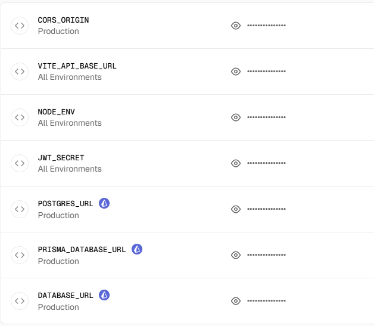

# Vercel 环境变量配置指南

## 必需的环境变量

在 Vercel 项目设置中配置以下环境变量:

### 数据库配置

```
DATABASE_URL=postgresql://用户名:密码@主机:端口/数据库名
```

或者分别配置:

```
DB_HOST=your-database-host
DB_PORT=5432
DB_NAME=pet_web
DB_USER=your-username
DB_PASSWORD=your-password
```

### 应用配置

```
NODE_ENV=production
PORT=3000
JWT_SECRET=your-jwt-secret-key-here
JWT_EXPIRES_IN=7d
```

### CORS 配置

```
CORS_ORIGIN=https://ski-row.cn
```

### Redis 配置 (可选)

```
REDIS_HOST=your-redis-host
REDIS_PORT=6379
REDIS_PASSWORD=your-redis-password
```

## 配置步骤

1. 登录 Vercel Dashboard: https://vercel.com/dashboard
2. 选择你的项目 (petsite-ve)
3. 进入 Settings → Environment Variables
4. 逐个添加上述环境变量
5. 选择环境: Production, Preview, Development (建议全选)
6. 点击 Save
7. 重新部署项目

## 数据库推荐

由于 Vercel Serverless Functions 的特性，推荐使用:

- **Neon** (https://neon.tech) - Serverless PostgreSQL
- **Supabase** (https://supabase.com) - 包含 PostgreSQL + 其他服务
- **Railway** (https://railway.app) - PostgreSQL + Redis

这些服务都提供免费套餐并且对 serverless 友好。

## 注意事项

⚠️ **重要**: Vercel Serverless Functions 有一些限制:

- 执行时间限制 (免费版 10 秒，Pro 版 60 秒)
- 内存限制 (免费版 1GB，Pro 版 3GB)
- 冷启动延迟
- 数据库连接池管理复杂

### 替代方案

如果遇到性能问题，建议将后端部署到:

- **Railway** (https://railway.app)
- **Render** (https://render.com)
- **Fly.io** (https://fly.io)

然后在前端 `.env.production` 中配置:

```
VITE_API_BASE_URL=https://your-backend-api.com/api
```
